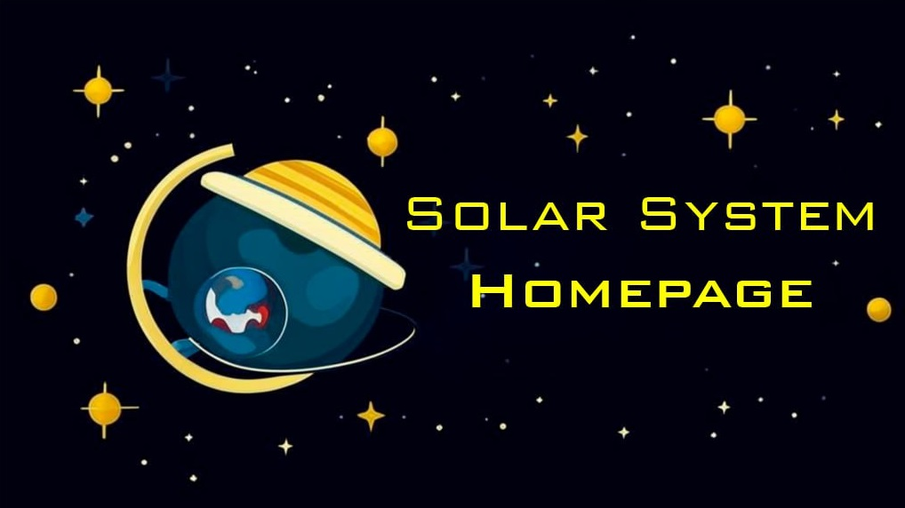

<p align="center">
  
</p>

# Solar-System-Homepage
The goal of the project is to create a visually attractive and interactive 3D homepage that immerses users in the atmosphere of space. This page is designed for use on various websites, where it can serve as a central hub for navigating through a variety of resources — from internal services to external products and projects.

## Setting up `UI`

- ### Visible UI
    In the website's code, there is a configuration line with the tag `homepage-settings`
    ```html
    <homepage-settings planets_list="true" planet_info="true" controls="true" news="true" info="true"></homepage-settings>
    ```
    This element contains attributes for controlling the visibility of various windows:

    - `planets_list` - Responsible for the visibility of the window with the list of all planets
    - `planet_info` - Responsible for the visibility of the window with the data of the selected planet
    - `controls` - Responsible for the visibility of the window with control information
    - `news` - Responsible for the visibility of the news window
    - `info` - Responsible for the visibility of the window with information about the site

    If the attribute value is `true`, the window becomes visible; otherwise, it disappears from view.

- ### Setting up news
    To manage the news, the block with the id `one_news_item` should be added to the block with the id `news_count_block`. If this block comes first, it should be given the class `enabled_news_item`. Afterward, specify the image path in the `src` attribute and the link the news will reference in the `href` attribute.

    ```html
    <div id="news_count_block">
            <div id="one_news_item" class="enabled_news_item" src="news_images/created_update png" href="#"></div>
    </div>
    ```

- ### Setting up controls
    To add new documentation on management, the element with the id `control_item` should be added to the element with the id `controls_info_block_list`. This element contains two objects: an image and a description.
    - ### image
        There are two types of images: those with the class `control_image_type` and those with the class `control_button_type`. `control_image_type` is used for images, while `control_button_type` is for text on a white background (keyboard keys). For `control_image_type`, you should add the CSS variable `--image-url` to locate the image.

        - `control_button_type`

            ```html
            <div id="control_image" class="control_image_type" style="--image-url: url('controls_images/right_click.png')"></div>
            ```
        - `control_image_type`
            ```html
            <div id="control_image" class="control_button_type"><div id="controls_button_text_wrapper">Q</div></div>
            ```
    - ### description
        The description uses the id `control_description`. Within this element is the `text_wrapper` with the class `controls_text_wrapper`, which is used to style the text in the description.
        ```html
        <div id="control_description"><div id="text_wraper" class="controls_text_wrapper">The Q key is used to select the previous news item on the news tab.</div></div>
        ```
## Setting up `Solar system`
The solar system is configured in the `index.js` file. In this project, the sun is configured separately, while the planets are configured dynamically. To use your own 3D model, it is recommended to use the 3D model format `glb`.

- ### Sun
    The configuration parameters for the sun look like this:
    ```js
    const SunModelPath = 'models/sun.glb';
    const normalMapPath = 'images/sun_normal_map.png';
    const bumpMapPath = 'images/sun_bump_map.png';
     ```
    
    And this is how the sun is added to the list of planets.
    ```js
    new_inner_planets_list += `<div id="item_planet" onclick="stop_prop(event)">
        <div id="image_planet"><model-viewer id="planet_model" disable-pan oncontextmenu="return false;" disable-zoom src="`+ SunModelPath +`" ar ar-modes="webxr scene-viewer quick-look" camera-controls shadow-intensity="0"></model-viewer></div>
        <div id="name_planet">`+ "Sun" +`</div>
        <div id="description_planet"><div id="text_wraper">`+ "Sun" +`</div></div>
        <div id="go_to_project_button">`+ "Go to sun" +`</div></div>`;
    ```

- ### Planets
    The configuration parameters for the planets look like this:
    ```js
    const planetData = [
        { name: 'Mercury', scale: 0.003, distance: 10, width: 32, height: 32, speed: 0.0010, model: "models/mercury.glb", three_name: "Cube008", description:"test", go_text:"go"},
        { name: 'Venus', scale: 0.0045, distance: 18, width: 32, height: 32, speed: 0.0009, model: "models/venus.glb", three_name: "cylindrically_mapped_sphereMesh", description:"test", go_text:"go"},
        { name: 'Earth', scale: 0.005, distance: 25, width: 32, height: 32, speed: 0.0008, model: "models/earth.glb", three_name: "Cube001", description:"test", go_text:"go"},
        { name: 'Mars', scale: 0.004, distance: 32, width: 32, height: 32, speed: 0.0007, model: "models/mars.glb", three_name: "mars", description:"test", go_text:"go"},
        { name: 'Jupiter', scale: 0.012, distance: 42, width: 32, height: 32, speed: 0.0006, model: "models/jupiter.glb", three_name: "cubemap", description:"test", go_text:"go"},
        { name: 'Saturn', scale: 0.009, distance: 61, width: 32, height: 32, speed: 0.0005, model: "models/saturn.glb", three_name: "Saturn001", description:"test", go_text:"go"},
        { name: 'Uranium', scale: 0.006, distance: 77, width: 27, height: 32, speed: 0.0004, model: "models/uranus.glb", three_name: "Uranus", description:"test", go_text:"go"},
        { name: 'Neptune', scale: 0.009, distance: 90, width: 32, height: 32, speed: 0.0003, model: "models/neptune.glb", three_name: "Neptune", description:"test", go_text:"go"}
    ];
    ```
    When adding your own planet, you just need to write its parameters in this list, and then the automatic algorithm will build the planet and its trajectory based on your parameters.

- ### Nebulae
    To create nebulae, you need to use the `createNebula` function with the parameters `x`, `y`, `z`, `_spread`, `_count`.

    - `x` - The x-coordinate of the nebula center.
    - `y` - The y-coordinate of the nebula center.
    - `z` - The z-coordinate of the nebula center.
    - `_spread` - The parameter that determines how far elements of a nebula can be from its center.
    - `_count` - The parameter that determines how many elements the nebula will have.

    ```js
    createNebula(1000,300,400, 200, 500000);
    createNebula(-400,100,300, 80, 5000);
    createNebula(-50,-400,-500, 100, 20000);
    ```

## Make a contribution
To contribute to this project, you can:

-  Use this website in your project
-  Share an example of its use on your website
-  Rate this project with a star.

## Resources used

- 3D models were taken from the `NASA` website.
